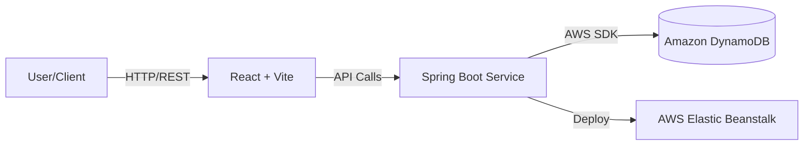

# 📦 Scalable Inventory Management System using DynamoDB

Access real-time inventory insights with our high-performance, scalable solution designed for modern e-commerce needs.

## 🚀 The Problem
Managing inventory at scale presents unique challenges:
*   **Race Conditions**: Simultaneous orders can lead to overselling.
*   **Scalability**: Traditional relational databases struggle with high-throughput read/write spikes during flash sales.
*   **Latency**: Users demand instant feedback on product availability.

This project solves these pain points by leveraging **AWS DynamoDB** for single-digit millisecond latency and seamless scalability, coupled with a reactive **Spring Boot** backend and a responsive **React** frontend.

## 🏗️ Architecture



## 🛠️ Core Workflows

1.  **Create Inventory Item**: Admin adds new products with initial stock levels.
2.  **Adjust Stock**: Real-time updates to inventory count (decrement on order, increment on restock). Handles concurrency to prevent race conditions.
3.  **Order Processing**: Creates orders, links them to customers, and tracks status (Pending -> Executed).
4.  **Search & Retrieval**: Efficient lookups by Item ID or Order ID.

## 📊 DynamoDB Modeling

This project follows an access-pattern-driven design to maximize DynamoDB efficiency.

### Table: `InventoryItems`
*   **Partition Key (PK)**: `itemId` (String)
*   **Sort Key (SK)**: *None*
*   **Billing Mode**: On-Demand (Recommended for sporadic traffic)
*   **Access Pattern**:
    *   `GetItem`: Retrieve product details by ID.
    *   `UpdateItem`: Atomic decrement/increment of stock.

### Table: `OrderItems`
*   **Partition Key (PK)**: `customerId` (String)
*   **Sort Key (SK)**: `orderTime` (String - ISO 8601)
*   **GSI**: `orderIdIndex` (PK: `orderId`)
*   **Billing Mode**: On-Demand
*   **Access Patterns**:
    *   **Get User Orders**: Query by `customerId` sorted by `orderTime` (default).
    *   **Get Specific Order**: Query GSI `orderIdIndex` by `orderId`.

## 📦 Dependency Management (POM)
The project uses `pom.xml` to manage dependencies efficiently:
*   **AWS SDK v2 BOM**: Uses `software.amazon.awssdk:bom` in the `<dependencyManagement>` section. This ensures all AWS SDK modules (like `dynamodb` and `dynamodb-enhanced`) use compatible versions without specifying versions for each dependency.
*   **DynamoDB Enhanced Client**: Uses `dynamodb-enhanced` to map Java objects directly to DynamoDB tables using annotations, reducing boilerplate code.

## 🔒 IAM & Security (Required for Deployment)
When running on AWS (e.g., Elastic Beanstalk), the application needs specific permissions. Create an **IAM Role** and attach it to your EC2 Instance Profile.

**Recommended Policy:**
```json
{
    "Version": "2012-10-17",
    "Statement": [
        {
            "Effect": "Allow",
            "Action": [
                "dynamodb:GetItem",
                "dynamodb:PutItem",
                "dynamodb:UpdateItem",
                "dynamodb:Query",
                "dynamodb:Scan"
            ],
            "Resource": [
                "arn:aws:dynamodb:us-east-1:YOUR_ACCOUNT_ID:table/InventoryItems",
                "arn:aws:dynamodb:us-east-1:YOUR_ACCOUNT_ID:table/OrderItems",
                "arn:aws:dynamodb:us-east-1:YOUR_ACCOUNT_ID:table/OrderItems/index/orderIdIndex"
            ]
        }
    ]
}
```

## ⚖️ Trade-offs & Design Decisions

### DynamoDB vs. PostgreSQL
*   **Why DynamoDB?**: Chosen for its predictable performance at any scale. While complex queries (joins) are harder, the primary need for fast Key-Value lookups and atomic counter updates (for stock) fits DynamoDB perfectly.
*   **Schema Design**: No joins means data is sometimes duplicated or fetched in parallel request, but ensures O(1) fetch time.

### Consistency Models
*   **Strong Consistency**: Used for **stock adjustments** to absolutely prevent overselling.
*   **Eventual Consistency**: Acceptable for **listing historical orders** or product descriptions, allowing for higher read throughput and lower costs.

## 💻 How to Run Locally

### Prerequisites
*   Java 17+
*   Node.js 18+
*   AWS Credentials configured (for DynamoDB access)

### Backend (Spring Boot)
1.  Navigate to root directory.
2.  Ensure your AWS credentials are set (e.g., `~/.aws/credentials`).
3.  Run the application:
    ```bash
    ./mvnw spring-boot:run
    ```
    *   Server starts on `http://localhost:5000`.

### Frontend (React)
1.  Navigate to `frontend` directory:
    ```bash
    cd frontend
    ```
2.  Install dependencies:
    ```bash
    npm install
    ```
3.  Start the development server:
    ```bash
    npm run dev
    ```
    *   Access the UI at `http://localhost:5173` (or port shown in terminal).

## ☁️ Deployment (AWS Elastic Beanstalk)

1.  **Build JAR**: 
    ```bash
    ./mvnw clean package
    ```
    This creates `target/demo-0.0.1-SNAPSHOT.jar`.
    
2.  **Create Application**:
    *   Go to **Elastic Beanstalk Console** > **Create Application**.
    *   **Platform**: Java (likely Java 17 running on Corretto).
    *   **Platform Branch**: Java 17 running on 64bit Amazon Linux 2023.

3.  **Upload Artifact**: 
    *   Select "Upload your code".
    *   Upload the local `.jar` file from `target/`.

4.  **Configure Environment**:
    *   **Instance Profile**: Attach the IAM Role created in the *IAM & Security* section to your environment's EC2 instances. **Crucial**: Without this, the app cannot talk to DynamoDB.
    *   **Environment Properties**:
        *   `SERVER_PORT`: `5000` (Default Spring Boot port is 8080, but this app listens on 5000).
        *   `AWS_REGION`: `us-east-1` (or your target region).

5.  **Launch**: Click Create and wait for the health check to pass.
